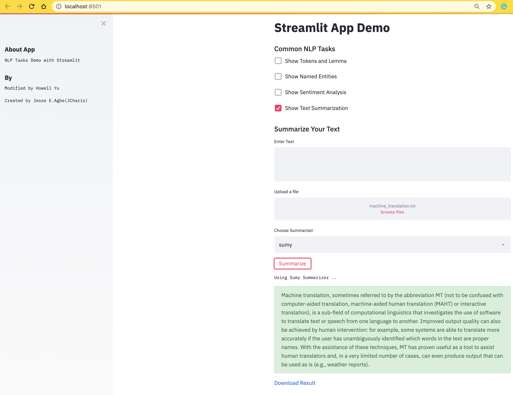

### Streamlit for Natural Language Processing Tasks

> Author: Qianhao Howell Yu        
> Source: https://blog.jcharistech.com/2019/10/22/building-a-natural-language-processing-app-with-streamlitspacy-and-python/    

### StreamLit Capabilities
- Text area, checkbox, multiple selection, slider, date.
- File upload, download, result display, markdown.
- Dataframe (pandas).
- Error handling.
- Header, sub-header, sidebar.

#### NLP Tasks
1. Tokenizer
  - [Spacy](https://spacy.io/api/doc)
2. Entity Extraction
  - [Spacy](https://spacy.io/api/doc)
3. Sentiment Analysis
  - [TextBlob](https://textblob.readthedocs.io/en/dev/)
4. Text Summarization
  - [Sumy](https://pypi.org/project/sumy/)
  - [Gensim](https://pypi.org/project/gensim/)

#### Setup
Execute the following command to install all the necessary dependencies, preferably in a Python virtual environment.
```shell
pip install -r requirements.txt
python -c "import nltk; nltk.download('punkt')"
python -m spacy download en
```

In case if one runs into SSL issue for Spacy language model installation, one can directly [download and install](https://github.com/explosion/spaCy-models) the language model with the following command. For instance, install the English Small model:

```shell
# pip install .tar.gz archive from path or URL
pip install /Users/you/en_core_web_sm-2.1.0.tar.gz
pip install https://github.com/explosion/spacy-models/releases/download/en_core_web_sm-2.1.0/en_core_web_sm-2.1.0.tar.gz
```

Then import the Spacy model in Python with the following command.      
Note: change dash to underscore in model name.      
```shell
import spacy
nlp = spacy.load("en_core_web_sm")
doc = nlp(u"This is a sentence.")
```

Execute the following command to launch the app. By default, the app will launch at http://localhost:8501/.
```shell
streamlit run app.py
```

#### Demo

